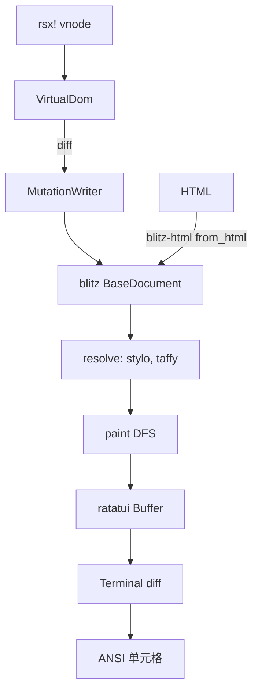

# lumin-tui

tui backend for blitz

Dataflow:

```mermaid
flowchart
  RSX[rsx! vnode] --> VD[VirtualDom]
  VD -->|diff| MW[MutationWriter]
  MW --> BD[blitz BaseDocument]
  HTML -->|blitz-html from_html| BD
  BD --> RES[resolve: stylo, taffy]
  RES --> PAINT[paint DFS]
  PAINT --> BUF[ratatui Buffer]
  BUF --> TERM[Terminal diff]
  TERM --> OUT[ANSI 单元格]
```
